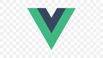

---
Covid questionaire is a web application which help users to give informormation about their covid sickness and vaccination status.
application form consists of 4 parts ,which are identification ,covid sickness history, covid vaccination history and suggestions for our company, where users should provide valid and correct information of themselves.
if filled up fields of the form are being valid, user should be able to send provided data to the company.
---

#

### Table of Contents

- [Prerequisites](#prerequisites)
- [Tech Stack](#tech-stack)
- [Getting Started](#getting-started)
- [Development](#development)

#

### Prerequisites

-  *Node@16.16.0 and up*
-  _npm@8 and up_

#

### Tech Stack

-  [Vue@3](https://vuejs.org/) - back-end framework

-  [TailwindCSS](https://tailwindcss.com/)

#

### Getting Started

1\. First of all you need to clone Covid questionaire repository from github:

```sh
git clone https://github.com/RedberryInternship/nika-khizambareli-covid-questionnaire
```

2\. Next step requires you to run _npm install_ in order to install all the dependencies.

```sh
npm install
```

and also:

```sh
npm run dev
```

in order to build your JS/SaaS resources.

4\. Now we need to set our env file. Go to the root of your project and execute this command.

```sh
cp .env.example .env
```

And now you should provide **.env** file all the necessary environment variables:

#

> VITE_APP_BASE_API=COMPANY_API_URL

##### Now, you should be good to go!

### Project Structure

Project structure is fairly straitforward(at least for laravel developers)...

For more information about project standards, take a look at these docs:

- [VueJs](https://vuejs.org/)
